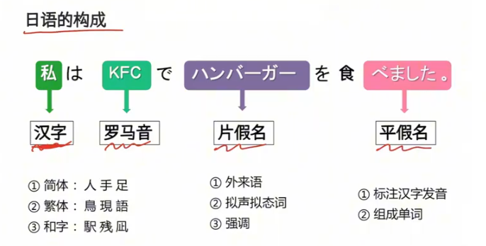
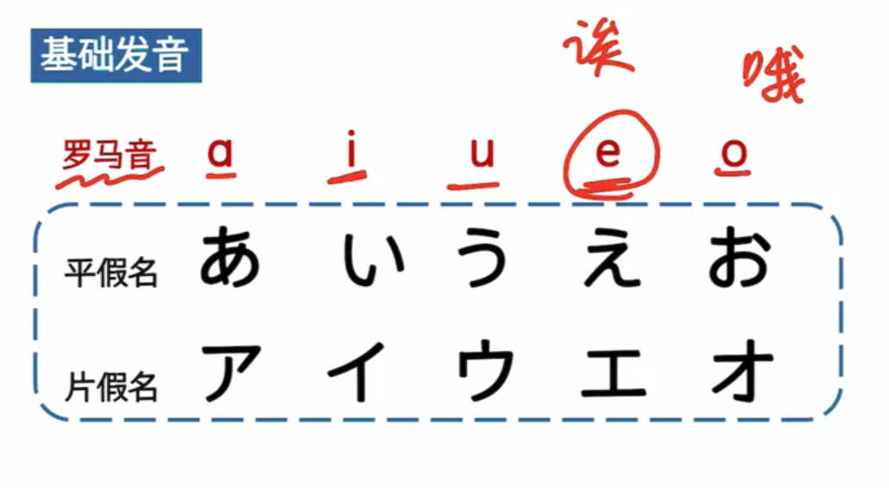
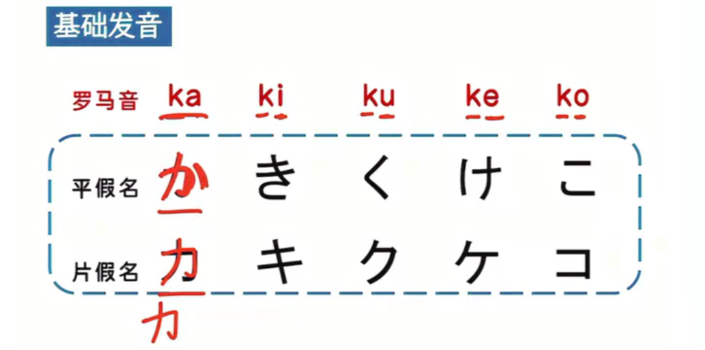
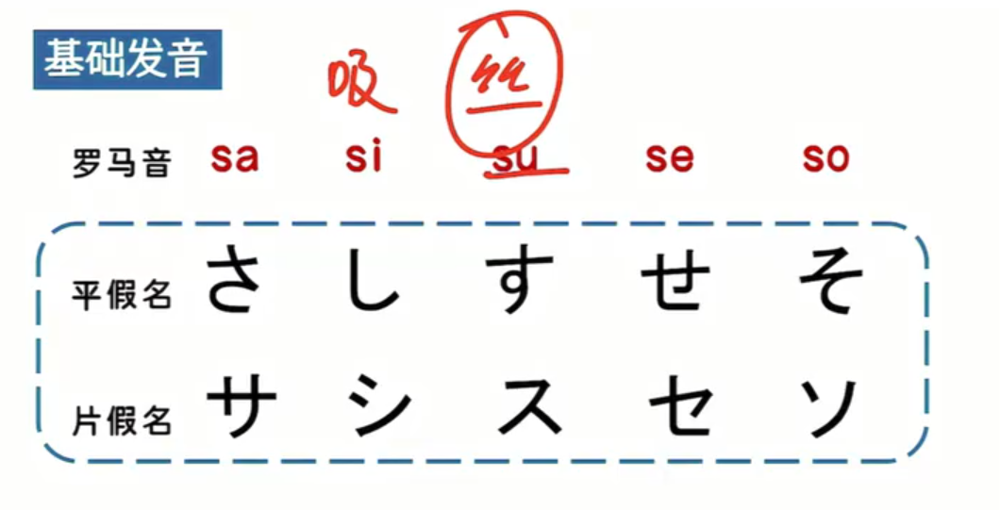

- **汉字**

  简体，繁体，和字（和字就是日本人改的汉字）

- 假名 就是中文的简化，假，就是借的意思，就是借过来的文字。

- 片假名和平假名，就相当于英文的大小写，读音相同，书写不同。

- 单一的假名没有意义。

- **平假名**

  平：书写比较平滑圆润，来自于中文的草书。

  作用：**标注汉字发音**（相当于中国的拼音），**组成单词**（组成一些没有汉字形式的单词，单一的假名没有意义）。

- **片假名**

  片：书写较为方正，来自于中文的楷书，但是可能不是整个字，可能是半个字或一部分，所以比较片面，叫片假名。

  作用：**（音译）外来语**（比如：汉堡，可乐，这些外来词汇），**拟声拟态**（模拟声音，比如狗汪汪叫；模拟状态样子），**表示强调**（本身是一个平假名，但是表示强调时写成方正的字体，表示强调）

- **罗马音**

  就是26个字母组成

  作用：**输入法打字**，**标注假名的发音**

  

a あ ア 一个(女)孩长胖(了)，发出(啊)的一声。
i  い イ 以为的以。
u う ウ 一个人被踹飞了，抢他的(宝)物，发出(呜)咽。
e え エ (唉)，(元)旦还要打(工)
o お オ (十)全十美的天(才)，长了一个(O)型腿，流了一滴泪。

ka か カ 头卡住了，用(力)拔，发出(咔)的一声
ki  き キ 像一把钥匙，key
ku く ク 工资(小于)别人(哭)了很(久)
ke け  ケ (计)划和别人P(K)砍(竹)子
ko こ コ 圆括号，方括号

